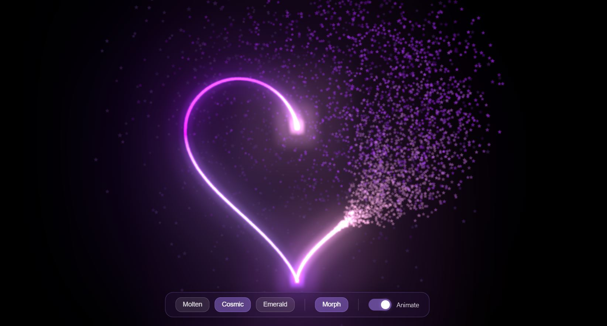

## Neon Heart Animation

A Three.js particle animation that morphs between a ⭐ star and ❤️ heart with glowing neon effects.

## Features

- Shape morph (Star ↔ Heart)
- Multiple color themes
- Smooth particle animation
- Interactive controls

## Preview

## Usage

Just open "index.html" in your browser.

# Developed by Sahriar Saif
https://github.com/sahriarsaif
